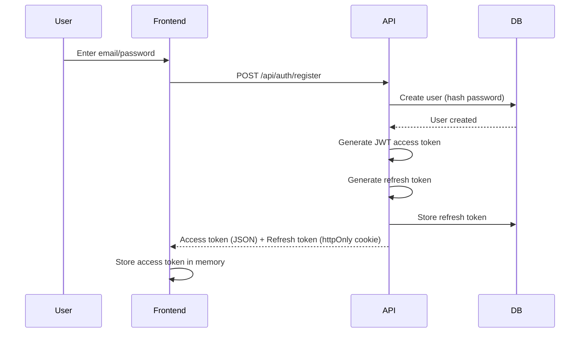
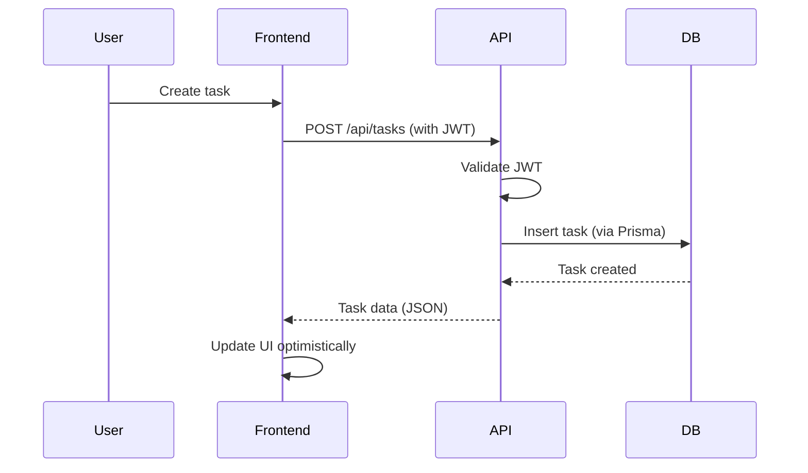
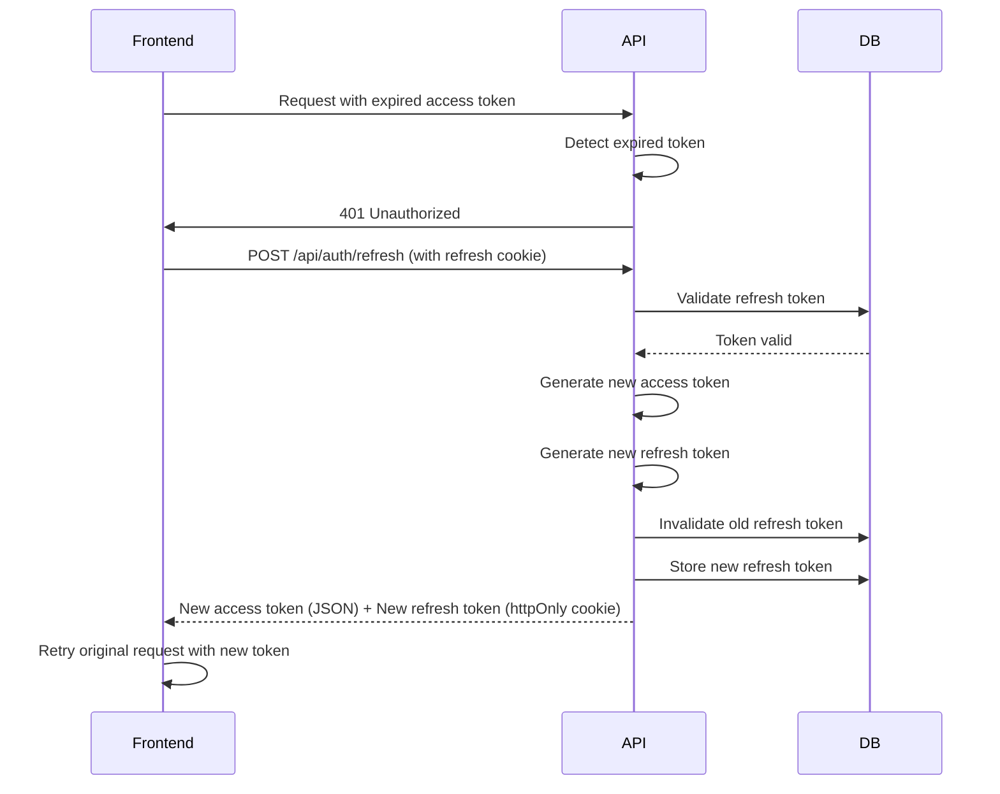

# Architecture

> **Document Type**: State (keep current)
>
> Last updated: 2026-01-07

---

## Overview

TaskFlow is a full-stack web application with a React + Vite frontend and an Express API backend. The system follows a traditional client-server architecture where the frontend communicates with the backend via RESTful APIs, and the backend manages all database interactions through Prisma ORM.

The application uses JWT-based authentication with refresh token rotation for secure, stateless session management.

---

## System Diagram

```
┌─────────────┐     HTTP/REST      ┌─────────────┐     Prisma ORM     ┌─────────────┐
│             │                    │             │                    │             │
│   React     │◄──────────────────►│   Express   │◄──────────────────►│ PostgreSQL  │
│   (Vite)    │   JWT + Cookies    │     API     │   SQL Queries      │  Database   │
│             │                    │             │                    │             │
└─────────────┘                    └─────────────┘                    └─────────────┘
     Port 5173                          Port 3001                         Port 5432
```

---

## Components

### Frontend (`apps/web`)

**Responsibility**: User interface, user interactions, and client-side state management.

**Location**: `apps/web/`

**Key Features**:

- React components for UI
- Vite for build tooling and HMR
- Tailwind CSS for styling
- API client for backend communication
- Local state management (React hooks/Context)

**Dependencies**:

- Backend API for all data operations
- Browser localStorage for client-side caching (optional)

**Key Interfaces**:

- REST API endpoints (via fetch/axios)
- JWT access token in Authorization header
- Refresh token via httpOnly cookie

---

### Backend API (`apps/api`)

**Responsibility**: Business logic, authentication, data validation, and database operations.

**Location**: `apps/api/`

**Key Features**:

- Express routes and middleware
- JWT token generation and validation
- Password hashing (bcrypt)
- Request validation
- Database queries via Prisma

**Dependencies**:

- PostgreSQL database
- Prisma Client for database access

**Key Interfaces**:

- RESTful API endpoints
- JWT authentication middleware
- Prisma Client for database operations

---

### Database (`infra/docker-compose.yml`)

**Responsibility**: Persistent data storage.

**Location**: PostgreSQL running in Docker container

**Key Features**:

- User accounts and authentication data
- Tasks and task metadata
- Refresh tokens (for rotation tracking)

**Schema Management**:

- Prisma schema defines all tables and relationships
- Migrations managed via Prisma Migrate

---

## Data Flow

### Authentication Flow



### Task CRUD Flow



### Refresh Token Rotation Flow



---

## Key Patterns

### Authentication Pattern

**Where used**: All protected API routes

**How it works**:

1. User logs in → receives JWT access token (short-lived, ~15min) and refresh token (long-lived, ~7 days)
2. Access token stored in memory (frontend), sent in `Authorization: Bearer <token>` header
3. Refresh token stored in httpOnly cookie, automatically sent with requests
4. When access token expires, frontend automatically calls `/api/auth/refresh` to get new tokens
5. Refresh tokens are rotated: each refresh generates a new refresh token and invalidates the old one

**Security Benefits**:

- Access tokens can't be stolen via XSS (stored in memory, not localStorage)
- Refresh tokens can't be accessed via JavaScript (httpOnly cookie)
- Token rotation limits impact of token theft

---

### API Client Pattern

**Where used**: Frontend API communication

**How it works**:

- Centralized API client handles all HTTP requests
- Automatically attaches JWT access token to requests
- Handles token refresh on 401 responses
- Provides typed interfaces for all endpoints

---

### Optimistic UI Pattern

**Where used**: Task creation, updates, deletion

**How it works**:

1. User action triggers immediate UI update (optimistic)
2. API request sent in background
3. On success: confirm UI state
4. On error: revert UI and show error message

**Benefits**: Perceived instant feedback, better UX

---

## Boundaries & Constraints

### Frontend Boundaries

- **Never directly accesses database**: All data operations go through API
- **No business logic**: Frontend handles presentation and user interaction only
- **Stateless**: No server-side session storage (JWT-based auth)

### Backend Boundaries

- **No direct database queries**: All database access via Prisma ORM
- **No frontend code**: Backend is API-only, no SSR
- **Stateless API**: No server-side session storage (except refresh token rotation tracking)

### Security Boundaries

- **CORS**: Only configured origins can access API
- **JWT validation**: All protected routes validate JWT signature and expiration
- **Password hashing**: Never store plaintext passwords
- **SQL injection prevention**: Prisma parameterized queries prevent SQL injection

---

## Database Schema (High-Level)

### Users Table

- `id` (UUID, primary key)
- `email` (string, unique)
- `passwordHash` (string, bcrypt)
- `createdAt` (timestamp)
- `updatedAt` (timestamp)

### Tasks Table

- `id` (UUID, primary key)
- `userId` (UUID, foreign key → Users)
- `title` (string)
- `completed` (boolean)
- `createdAt` (timestamp)
- `updatedAt` (timestamp)
- `dueDate` (timestamp, nullable) - for future Should-Have feature
- `category` (string, nullable) - for future Should-Have feature

### RefreshTokens Table (for rotation)

- `id` (UUID, primary key)
- `userId` (UUID, foreign key → Users)
- `token` (string, hashed)
- `expiresAt` (timestamp)
- `createdAt` (timestamp)

---

## Technology Choices Rationale

See `docs/how-to-work/decisions.md` for detailed ADRs on:

- Why React + Vite
- Why Express API
- Why JWT with refresh token rotation
- Why Prisma ORM

---

## Future Considerations

### Scalability

- Current architecture supports single-instance deployment
- For horizontal scaling: consider Redis for refresh token storage
- Database connection pooling via Prisma

### Performance

- API response caching (future enhancement)
- Frontend code splitting (Vite handles this)
- Database query optimization (indexes via Prisma)

### Monitoring

- API health check endpoint: `/api/health`
- Error logging and tracking (to be implemented)
- Performance metrics (to be implemented)
